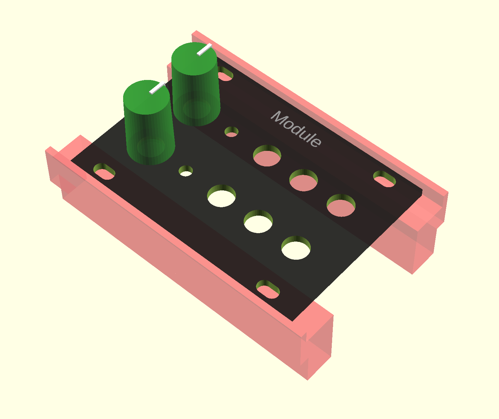

# Eurorack module layout planer

Simple OpenSCAD module that allows you to create configurable eurorack module panels. I created it mainly to be able to visualise user facing components layout and to have a reference for dimensions and clearences regarding PBC size. 

### Features:

- [x] configurable module panel size (in HP and U)
- [x] automatically added mounting holes
- [x] mounting rails shadow
- [x] ability to place component holes in panel face (gird layout only)
- [x] an option to put knobs over choosen holes (to simulate potentiometer placement)
- [ ] additional comopnents (jacks, pots, leds, switches)
- [ ] PCB surface

### Example

```
include <panel.scad>

EurorackModule("Module", hp = 12, u = 1, holes = [
    [6, 3, 6, 6, 6],
    [6, 3, 6, 6, 6]
], comps = [
    // n/a yet
], knobs = [
    [0.8, 0, 0, 0, 0],
    [0.8, 0, 0, 0, 0]
]);
```

### Output


